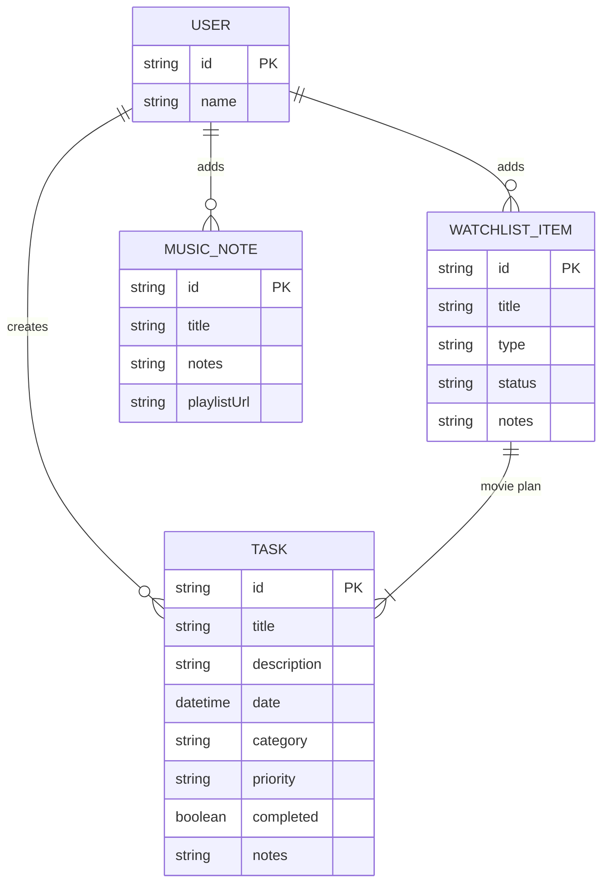

# Cozy Dates Data Model

This diagram represents the planned database if tasks, watchlist items and music notes were stored in a relational database. Currently the project persists these elements in the browser's `localStorage`.
