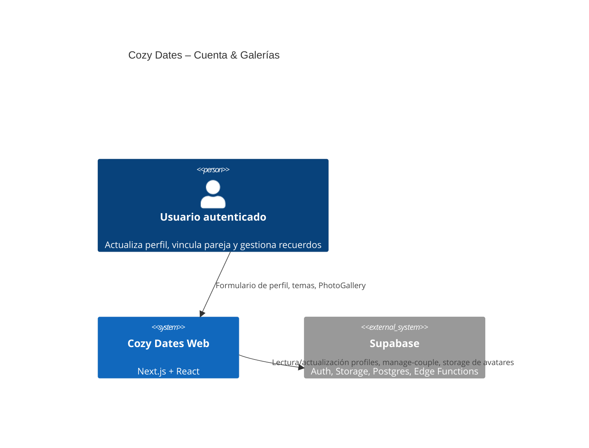
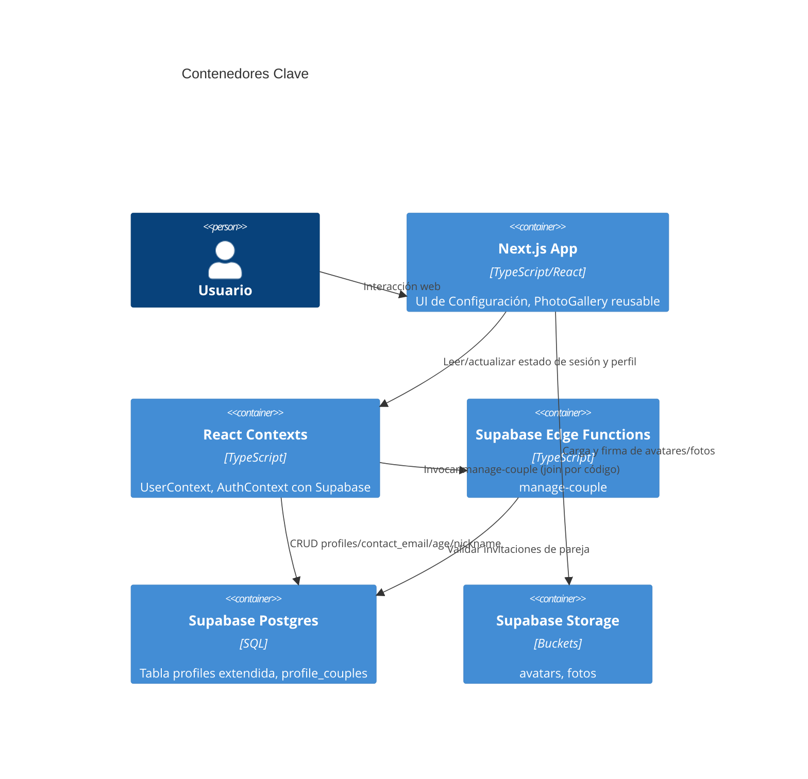

# C4 Diagramas – Renovación Configuración de Cuenta

## C1 – Contexto

```mermaid
C4Context
    title Cozy Dates – Cuenta & Galerías
    Person(usuario, "Usuario autenticado", "Actualiza perfil, vincula pareja y gestiona recuerdos")
    System(app, "Cozy Dates Web", "Next.js + React")
    System_Ext(supabase, "Supabase", "Auth, Storage, Postgres, Edge Functions")

    Rel(usuario, app, "Formulario de perfil, temas, PhotoGallery")
    Rel(app, supabase, "Lectura/actualización profiles, manage-couple, storage de avatares")
```

## C2 – Contenedores

```mermaid
C4Container
    title Contenedores Clave
    Person(usuario, "Usuario")
    Container(web, "Next.js App", "TypeScript/React", "UI de Configuración, PhotoGallery reusable")
    Container(ctx, "React Contexts", "TypeScript", "UserContext, AuthContext con Supabase")
    Container(edge, "Supabase Edge Functions", "TypeScript", "manage-couple")
    Container(db, "Supabase Postgres", "SQL", "Tabla profiles extendida, profile_couples")
    Container(storage, "Supabase Storage", "Buckets", "avatars, fotos")

    Rel(usuario, web, "Interacción web")
    Rel(web, ctx, "Leer/actualizar estado de sesión y perfil")
    Rel(ctx, db, "CRUD profiles/contact_email/age/nickname")
    Rel(ctx, edge, "Invocar manage-couple (join por código)")
    Rel(web, storage, "Carga y firma de avatares/fotos")
    Rel(edge, db, "Validar invitaciones de pareja")
```
