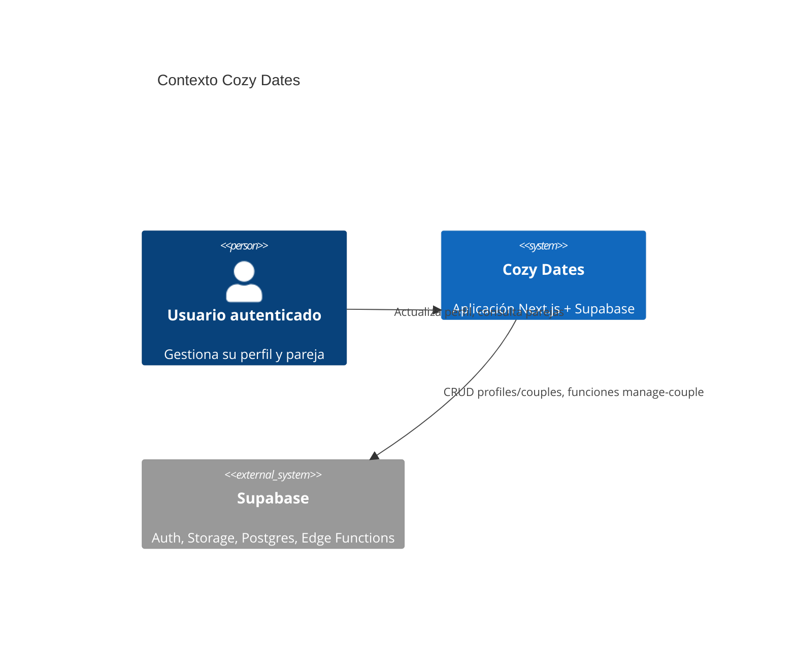
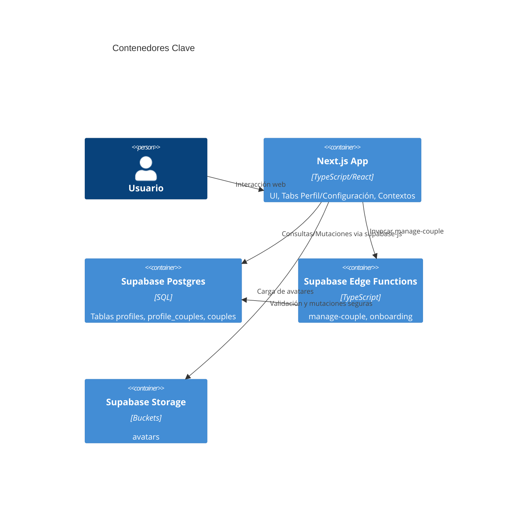

# C4 Diagramas – Perfil/Configuración

## C1 – Contexto

```mermaid
C4Context
    title Contexto Cozy Dates
    Person(user, "Usuario autenticado", "Gestiona su perfil y pareja")
    System(system, "Cozy Dates", "Aplicación Next.js + Supabase")
    System_Ext(supabase, "Supabase", "Auth, Storage, Postgres, Edge Functions")

    Rel(user, system, "Actualiza perfil, consulta parejas")
    Rel(system, supabase, "CRUD profiles/couples, funciones manage-couple")
```

## C2 – Contenedores

```mermaid
C4Container
    title Contenedores Clave
    Person(user, "Usuario")
    Container(app, "Next.js App", "TypeScript/React", "UI, Tabs Perfil/Configuración, Contextos")
    Container(supabaseDb, "Supabase Postgres", "SQL", "Tablas profiles, profile_couples, couples")
    Container(supabaseEdge, "Supabase Edge Functions", "TypeScript", "manage-couple, onboarding")
    Container(storage, "Supabase Storage", "Buckets", "avatars")

    Rel(user, app, "Interacción web")
    Rel(app, supabaseDb, "Consultas/Mutaciones via supabase-js")
    Rel(app, storage, "Carga de avatares")
    Rel(app, supabaseEdge, "Invocar manage-couple")
    Rel(supabaseEdge, supabaseDb, "Validación y mutaciones seguras")
```
